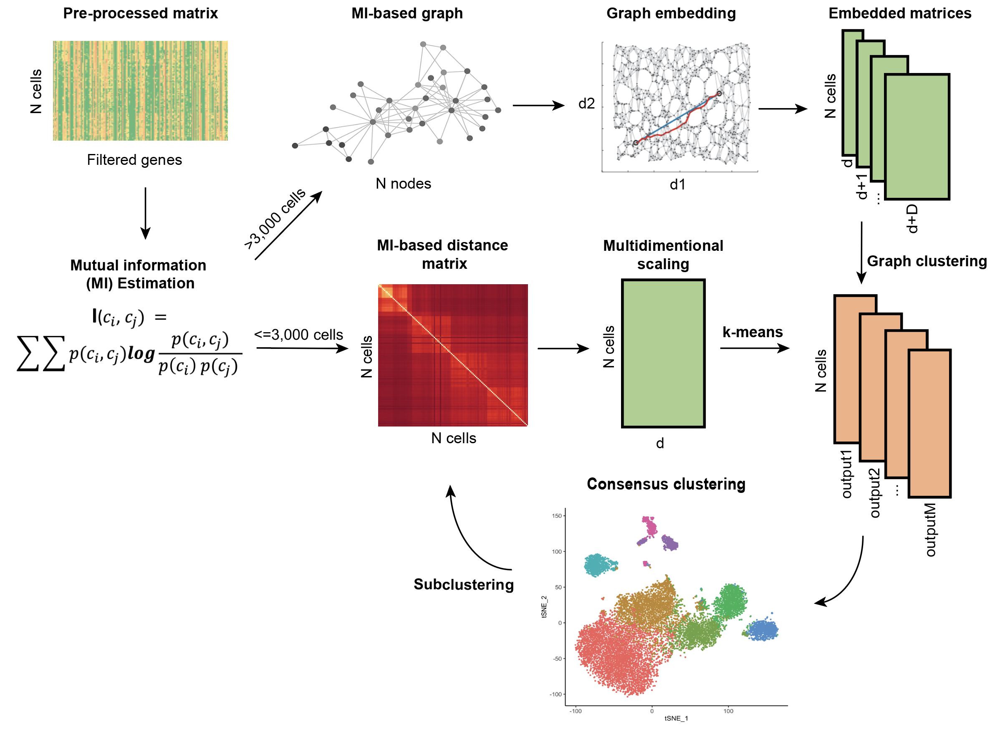

# MICA

MICA is a clustering tool for single-cell RNA-seq data. MICA takes a preprocessed gene expression matrix as input and
efficiently cluster the cells.
MICA consists of the following main components:
1. Mutual information estimation for cell-cell distance quantification
2. Dimension reduction on the non-linear mutual information-based distance space
3. Consensus clustering on dimension-reduced spaces
4. Clustering visualization and cell type annotation

MICA workflow:




## Prerequisites
* [python>=3.7.6, <=3.9.2](https://www.python.org/downloads/) (developed and tested on python 3.7.6, tested on python3.9.2)
    * See [requirements.txt](https://github.com/jyyulab/MICA/blob/million/requirements.txt) file for other dependencies


## Installation
#### Using conda to create a virtual environment 
##### (Not available until this line is removed)
The recommended method of setting up the required Python environment and dependencies 
is to use the [conda](https://conda.io/docs/) dependency manager:
```
conda create -n mica100 python=3.9.2        # Create a python virtual environment
source activate mica100                     # Activate the virtual environment
pip install MICA                            # Install MICA and its dependencies
```

#### Install from source
```
conda create -n mica100 python=3.9.2        # Create a python virtual environment
source activate mica100                     # Activate the virtual environment
git clone https://github.com/jyyulab/MICA   # Clone the repo
cd MICA                                     # Switch to the MICA root directory
pip install .                               # Install MICA from source
mica -h                                     # Check if mica works correctly
```


## Usage
MICA workflow has two built-in dimension reduction methods. The auto mode (```mica``` or ```mica auto```) 
selects a dimension reduction method automatically based on the cell count of the preprocessed matrix. 
Users can select graph embedding method (```mica ge```)  or MDS (```mica mds```) or Louvain (```mica louvain```) method manually using the subcommand 
```ge``` or ```mds``` or ```louvain``` respectively. 
```
$ mica -h
usage: mica [-h] {auto,ge,mds} ...

MICA - Mutual Information-based Clustering Analysis tool.

optional arguments:
  -h, --help     show this help message and exit

subcommands:
  {auto,ge,mds}  versions
    auto         automatic version
    ge           graph embedding version
    mds          MDS version
    louvain      simple louvain version
```
Use ```mica ge -h```, ```mica mds -h```, and ```mica louvain -h``` to check helps with subcommands.

#### Inputs
The main input for MICA is tab-separated cells/samples by genes/proteins (rows are cells/samples) expression 
matrix or an [anndata](https://anndata.readthedocs.io/en/latest/index.html) file after preprocessing.


#### Outputs
After the completion of the pipeline, `mica` will generate the following outputs:
* Clustering results plot with clustering label mapped to each cluster
* Clustering results txt file with visualization coordinates and clustering label


## Examples
#### Running MICA auto mode
MICA auto mode reduces the dimensionality using either the multidimensional scaling method (<= 5,000 cells) or 
the graph embedding method (> 5,000 cells), where the number of cells cutoff was chosen based on performance
evaluation of datasets of various sizes. 

`mica auto -i ./test_data/inputs/10x/PBMC/3k/pre-processed/pbmc3k_preprocessed.h5ad -o ./test_data/outputs -pn pbmc3k -nc 10`

#### Running MICA GE mode
MICA GE mode reduces the dimensionality using the graph embedding method. It sweeps a range of resolutions
of the Louvain clustering algorithm. ```-ar``` parameter sets the upper bound of the range.

`mica ge -i ./test_data/inputs/10x/PBMC/3k/pre-processed/pbmc3k_preprocessed.h5ad -o ./test_data/outputs
-ar 4.0 -ss 1`

The default setting is to build the MI distance-based graph with the K-nearest-neighbors algorithm, and the number of the neighbors can be set with ```-nnm```. Another way to build the graph is to run approximate-nearest-neighbors(ann) based on the Hierarchical Navigable Small World(HNSW) algorithm. Set ```-nnt```(knn or ann) to enable nn type selection.

Here are 2 main hyperparameters in ann, ef(```-annef```) and m(```-annm```). Suggested setting:
* default
* Really fast m = 4, ef = 200
* Accurate m = 16, ef = 800

Optimize these 2 parameters to make them work on your case, to make the ge mode both fast and robust. Please increase ef when ```-nnm``` is increased.

`mica ge -i ./test_data/inputs/10x/PBMC/3k/pre-processed/pbmc3k_preprocessed.h5ad -o ./test_data/outputs
-nnt ann -annm 8 -annef 400 -ar 4.0 -ss 1`

To set the number of neighbors in the graph for Louvain clustering, please set ```-nne```

#### Running MICA MDS mode
MICA MDS mode reduces the dimensionality using the multidimensional scaling method. It includes both Kmeans clustering and louvain clustering.
To run KMeans mode please set ```-nck```, to run louvain graph clustering, please set ```-nn``` or as default.
```-pn``` parameter sets the
project name; ```-nck``` specifies the numbers of clusters (k in k-mean clustering algorithm); ```-dd``` is the
number of dimensions used in performing k-mean clusterings in the dimension reduced matrix.

`mica mds -i ./test_data/inputs/10x/PBMC/3k/pre-processed/pbmc3k_preprocessed.h5ad -o 
./test_data/outputs -pn PBMC3k -nck 8`

#### Running MICA Louvain mode
MICA Louvain mode reduces the dimension without MI distance estimate via PCA or MDS directly, and then the Louvain clustering will be executed.
To set the dimension-reduction method, please set ```-dm``` (PCA or MDS)

'mica louvain -i ./test_data/inputs/10x/PBMC/3k/pre-processed/pbmc3k_preprocessed.h5ad -o 
./test_data/outputs -dm PCA'

## Some sharing parameters
```-dd```: Number of dimensions to reduce to

```-cldis```: distance in Louvain clustering, euclidean/cosine

```-bpr```: set the power index of the bin size for MI, 3 -> bins=(features)**(1/3)

```-bsz```: set the bin size for MI

```-sil```: run silhouette analysis for louvain clustering

```-nw```: num of workers

## Some common issues for St Jude HPC users

1. Try to install MICA 1.0.0 but when checking, it’s still old version: 

Solve: make sure to create a new folder and change direction into there before you start Step 1, if you’ve have a like ‘MICA’ at the current direction.

```bash
mkdir MICA100
cd MICA100
#start installation
```

2. Illegal instruction(core dumped) or other problem when importing mihnsw

Often because of the conda version or gcc version

try:

```bash
module load conda3/202402
module load gcc/10.2.0
#others may also works like gcc 9.5.0
```

## Reference
hnswlib: https://github.com/nmslib/hnswlib. The author of MICA adds a 'mutual-info-distance' to the space of hnswlib.

To be added
